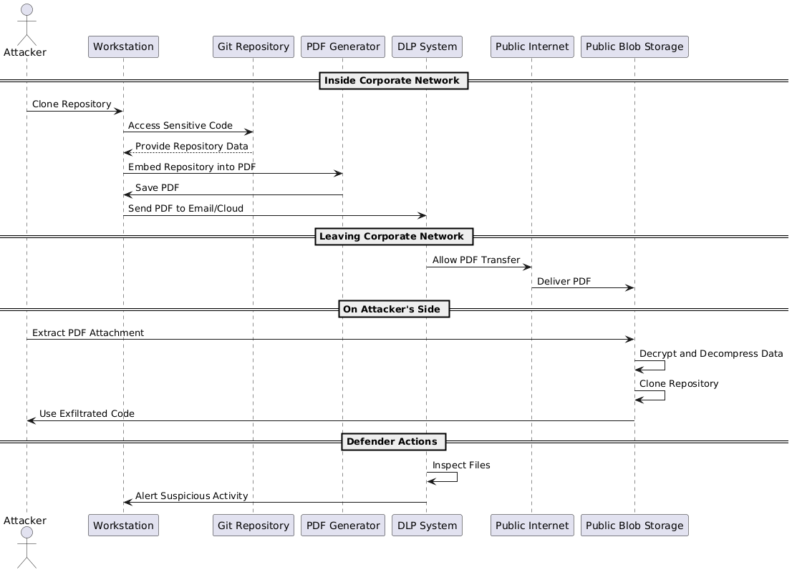

# Proof of Concept: Embedding and Extracting Git Repositories in PDFs

Inspired by [Proof of Concept or GTFO: 15-07](https://github.com/angea/pocorgtfo/blob/master/contents/articles/15-07.pdf), this PoC demonstrates a covert method for exfiltrating Git repositories by embedding them in PDFs. It highlights risks for security teams and emphasizes the need for proactive defenses.

## Sequence
This diagram illustrates the sequence of steps in the attack scenario, from embedding sensitive code in a PDF to extracting it outside the corporate network.



## Overview

### Operations
1. **Embed**: Bundle, encrypt, compress, and embed a Git repository into a PDF.
2. **Extract**: Decrypt, decompress, and extract the repository to restore its original state.

### Features
- **Obfuscation**: Payloads are encrypted and compressed, avoiding detection.
- **Extensible**: Can scale to multiple repositories and integrate with enterprise systems.
- **Low Effort**: Minimal setup required for high-impact attacks.

## Security Implications

### Risks
- Exfiltration of sensitive source code bypassing traditional DLP mechanisms.
- Encrypted and compressed attachments evade simple signature-based detection.

### Impact
- Loss of IP and competitive advantage.
- Catastrophic risk from mass repository exfiltration in enterprise environments.

## Defensive Measures

### Low-Effort Defenses
- Scan PDFs for unusual attachments.
- Enforce role-based access and MFA for repositories.

### Detection
- Monitor file size anomalies and high-entropy data in outbound documents.
- Detect anomalous repository cloning and PDF generation.

## Quick Start
Simulate the attack using:
```bash
make poc
```